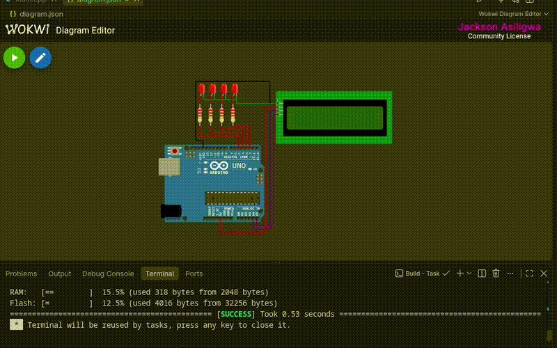

# 4-Bit Arduino_Uno_R3 Binary Counter (Hardware & Firmware)

**Author:** Jackson  Asiligwa
**Status:** Completed Proof of Concept

This project demonstrates a full-stack embedded hardware design for a 4-bit binary counter using arduino uno R3, complete with an I2C LCD readout and discrete LED indicators. 

## Tech Stack
* **Firmware:** C++, PlatformIO, Arduino Framework
* **Hardware Design:** KiCad 8 (Schematic Capture & PCB Layout)
* **Simulation:** Wokwi in VS Code.
                  diagram.json in Wokwi web

## Simulation & Logic Verification
The logic and firmware were verified using the Wokwi simulator before routing physical hardware. The simulation verifies the 4-bit counting logic across the digital output pins and I2C text rendering.

## Hardware Design
The PCB acts as a custom carrier board (shield) for the Arduino Uno R3. It features standard 2.54mm headers for an I2C LCD backpack and utilizes through-hole (THT) resistors for LED current limiting.

## How to Run Locally
1. Clone this repository.
2. Open the folder in VS Code with the PlatformIO extension installed.
3. To view the simulation, install the Wokwi extension,get the commnunity licence(it's easy and fast-less than 10 seconds), open `diagram.json` file in the root folder, and start the simulator.